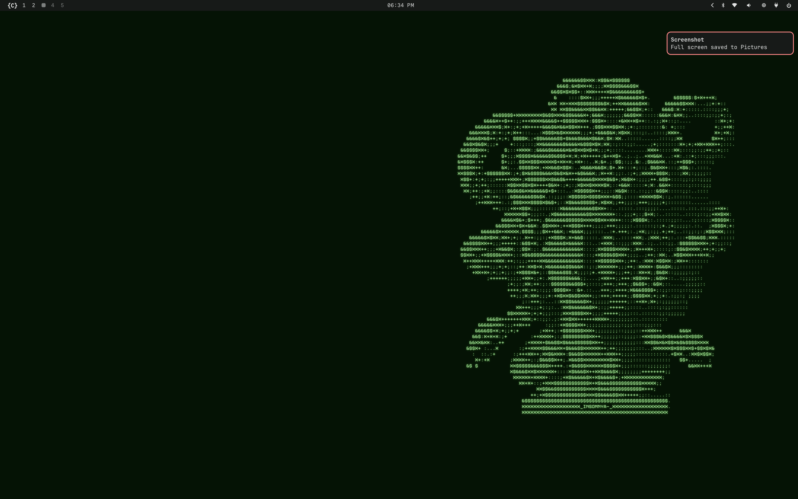
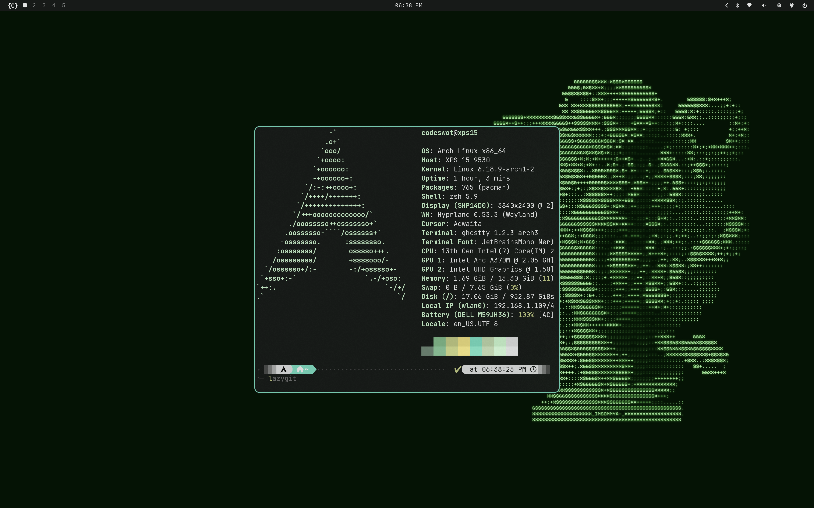
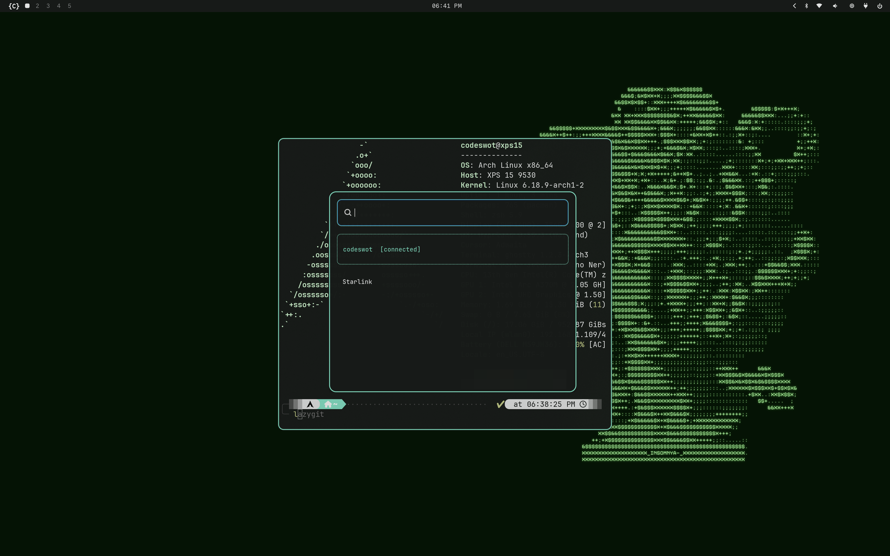

# 🌌 Codeswot's Awesome Linux Rice

This is the ultimate home for my personal desktop environment—a high-fidelity, minimal, and premium setup built for Hyprland. Optimized for the Dell XPS 15 (High DPI) but designed to feel premium on any hardware.

## 📸 Gallery
<div align="center">
  
  <br>
  
  <br>
  <em>Main Workspace & Desktop View</em>
  <br><br>
  
  
  <br>
  <em>Application Menus & System Components</em>
</div>


## 🌿 Multi-Style Branching
This repository is designed to grow! While the `master` branch features the refined **Aether** theme, I'll be creating separate branches for different styles:
- `master`: The core Aether experience (Minimal, 12-hour clocks, centered layouts).
- `future-branches`: Upcoming designs with different components (e.g., Sway, Ags, different colorways).

## ✨ Aether Features
- **Visual Symmetry**: Perfectly mirrored design between SDDM (login) and Hyprlock (lock screen).
- **Branded Bar**: Custom Waybar with {C} Ghostty trigger, bold typography, and Nerd Font 3 icons.
- **Sync System**: Automated wallpaper synchronization between user session and greeter.
- **Smart Wi-Fi**: Custom Wofi script using `iwd` with active connection tracking.
- **Clean Clocks**: Uniform, spacious 12-hour time format (e.g., 9:26) across all layers.

## 🛠 Tech Stack
- **Compositor**: Hyprland
- **Bar**: Waybar
- **Menus**: Wofi (Custom scripts for Power, Wi-Fi, and Apps)
- **Lock**: Hyprlock + Hypridle
- **Terminal**: Ghostty
- **Shell**: Zsh (p10k + Oh My Zsh)
- **Login**: SDDM (Aether Theme)

## 🚀 Installation

1. **Clone & Setup**:
   ```bash
   git clone https://github.com/codeswot/awesome-dotfiles.git ~/.dotfiles
   cd ~/.dotfiles
   ```

2. **Run Installer**:
   ```bash
   chmod +x install.sh
   ./install.sh
   ```

## 📸 Attribution
- Built with **Omarchy** theme engine.
- Fonts: JetBrains Mono Nerd Font, CommitMono Nerd Font.
